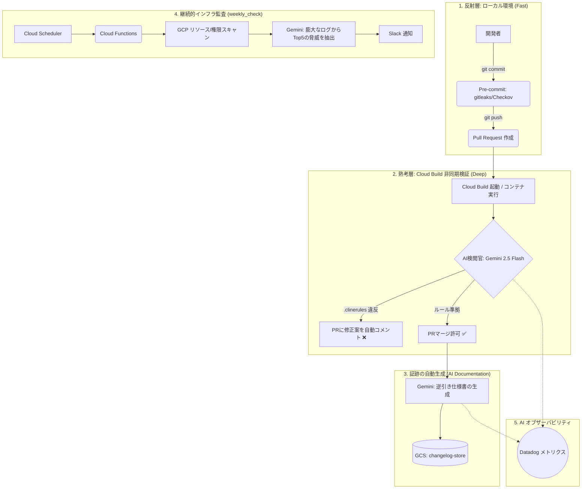

# GCP-base: Google Cloud 基盤構築キット

「ベンチャーの基盤」を前提に設計したGCPの基盤構築キットです。ベンチャーだから「開発スピードは落としたくない」としながらも「いつかのIPO」や「お客さんの個人情報を扱う」ためのセキュリティとガバナンスを担保しています。

## 主な機能 (Core Features)

1.  **GitOps によるProject Factory**
    - `inventory.json` を更新することで、プロジェクト作成から WIF・予算設定まで自動実行します。
2.  **台帳同期型サンドボックス**
    - 期限が来ると「台帳（Git）」と「実体（GCP）」を自動でクリーンアップして、ゾンビ化を物理的に防止します。
3.  **職務分掌による安全なデプロイ**
    - 本番の書き換えを中央の Runner に集約しました。最小権限（Viewer）での安全なアプリ運用を強制します。
4.  **AI による週次セキュリティ監査**
    - Gemini 2.5-flash が「今すぐ対応すべき Top 5」を抽出してSlack 通知でおしらせします。
5.  **開発者向け自動セットアップ**
    - プロジェクト完成時、開発者はサンプルキットをDLするだけでWIFによるapply/deployが可能に。
6.  **AI 駆動型クロス検証 (Cloud Build CI)**
    - Gemini 2.5-flash が Pull Request 作成時に設計思想 (`.clinerules`) および過去の人間判断 (`logs/active_rules.md`) との整合性を自動レビュー。承認された変更の逆引き仕様書（変更証跡）を自動生成してGCSバケットに直送・保存し、検証結果を GitHub PR コメントとしてフィードバック（Suggested Changes 含む）します。
7.  **CIS GCP ベースライン Checkov (governance / modules)**
    - Google Cloud CIS Benchmark に基づく Checkov が `governance/` と `modules/` を対象に MEDIUM 以上の脆弱性をハードフェイルでブロック。客観的なIAM・ネットワーク・削除保護チェックはツールに委譲し、AIは設計判断に集中します。
8.  **Datadog メトリクス監視（ON/OFF 切り替え可）**
    - AI検閲の結果（pass/fail）を `result` / `category` / `author` 等のリッチなタグ付きで Datadog へ送信。`DATADOG_ENABLED=false` 1行で無効化可能。
9.  **AI レビュアーの回帰テスト（promptfoo evals）**
    - 「AIにレビューさせているが、そのAI自身の精度は誰が保証するのか？」への答え。AI検閲官の判定精度をゴールデンセット（合格/不合格にすべき diff・**プロンプトインジェクション耐性ケース含む**）への回帰テストで機械検証します。本番と同一のプロンプトをテストし、検閲基準を変更する PR では CI が自動実行（全ケース合格しないとマージ不可）。判定は決定的文字列マッチのみで LLM-as-a-judge を使わないため判定側の AI 課金はゼロ（実行コストはテスト対象の Gemini 呼び出し分の Vertex AI 従量課金のみ）・promptfoo はサインアップ不要の OSS（`evals/` 参照）。

## AI オーケストレーション全体像 (Architecture Overview)

上記の機能群は、「開発者のリズムを止めない反射層（ローカル）」と「回避不能な熟考層（Cloud Build CI）」を組み合わせた、PR ベースの非同期フィードバックループとして連携します。



> レビュー層（Layer 0/1/2）の責任分界・判定基準の詳細は [`docs/QUALITY_FEEDBACK_LOOP.md`](docs/QUALITY_FEEDBACK_LOOP.md) を参照。

## 前提条件 (Prerequisites)

本プロジェクトのデプロイと運用には以下の環境が必要です。

- **Terraform:** `>= 1.5.0` (推奨: 最新の 1.x 系)
- **Google Cloud SDK (gcloud):** 最新版を推奨
- **Python:** `3.11` (通知用 Cloud Functions のランタイム)
- **GCP 権限:** 組織管理者 (Organization Administrator) またはそれに準ずる権限

## ディレクトリ構成 (Directory Structure)

```text
gcp-base/
├── .clinerules             # AIへのプロジェクト憲法（設計原則・禁止事項）
├── .checkov.yaml           # Checkov CIS GCP 設定（意図的除外の管理）
├── .github/                # GitHub Actions ワークフロー定義
├── apps/                   # 各アプリ用スターターキット（テンプレート）
├── docs/                   # 思想、技術仕様、運用ガイド
│   ├── ARCHITECTURE.md     # 思想・権限設計・ネットワーク
│   ├── SPECIFICATION.md    # 【詳細】各機能の技術仕様
│   └── PROJECT_GUIDE.md    # 開発者向け利用ガイド
├── governance/             # ガバナンス・基盤構築レイヤー
│   ├── org-policies/       # 【組織】組織ポリシー（ガードレール）
│   └── admin/              # 【基盤】管理用リソース
│       ├── foundation/     # 基盤共通（WIF, 予算通知, 監視, セキュリティ）
│       └── factory/        # プロジェクト工場（各アプリ環境の払い出し）
├── infra/                  # 基盤オートメーション機能
│   └── modules/            # 監査ボット, ライフサイクル管理
├── logs/
│   ├── judgments.md        # 人間による判断の監査証跡（append-only）
│   └── active_rules.md     # AIが読む判例集（upsert運用・行数一定）
├── modules/                # 再利用可能な Terraform モジュール群
│   ├── project_factory/    # プロジェクト払い出しエンジン
│   ├── billing_base/       # 予算アラート通知
│   └── vpc_base/           # 疎結合な VPC 構築
├── scripts/                # bootstrap.sh 等の自動化スクリプト
└── README.md               # 本ファイル
```

## 構築手順 (初回セットアップ)

### Step 1: 物理土台の作成 (Bootstrap)
ルートディレクトリで初期スクリプトを実行してGCPプロジェクトと権限の土台を作ります。

1. `governance/admin/terraform.tfvars` を作成。
2. `governance/org-policies/terraform.tfvars` を作成。
3. ターミナル（ルートディレクトリ）で以下を実行:
   ```bash
   chmod +x scripts/*.sh
   ./scripts/bootstrap.sh
   ./scripts/setup_secrets.sh
   ```
   ※ `setup_secrets.sh` を実行すると、Slack Webhook URL 等の入力を求められます。**入力値は端末に表示されません**（単一行の値は非表示入力、複数行の秘密鍵はファイルパス指定で、シークレットを画面・スクロールバックに残しません）。AI 機能は Vertex AI の ADC 認証を使うため、Gemini API キーは不要です。
   > **💰 AI 機能のコスト・リージョンについて**
   > 監査Bot の脅威 Top5 要約と PR 検閲は **Vertex AI (Gemini)** を利用するため、実行に応じた**課金が発生します**（キーレスの ADC 認証・`roles/aiplatform.user`）。導入前に以下を確認してください（いずれも `weekly_check` モジュールの terraform 変数で調整します）。
   > - **モデル / リージョンは変更可能**: 既定はモデル `gemini-2.5-flash`（低コスト帯）・リージョン `asia-northeast1`。データレジデンシーや課金要件に応じて変数 `gemini_model` / `vertex_location` で上書きできます（Cloud Function の `GEMINI_MODEL` / `VERTEX_LOCATION` 環境変数に反映されます）。
   > - **コストを抑えたい / AI 不要な場合**: 変数 `enable_ai_summary = false` で AI 要約を無効化できます（スキャン①〜⑨や Slack 通知は動作し、AI 要約だけ省略）。
   > - **呼び出し頻度は低め**: 監査Bot は既定で**週次**実行のため、標準的な利用なら `gemini-2.5-flash` で少額に収まります（実コストは利用リージョンの Vertex AI 料金に従います）。
4. **Git フックの有効化**: gitleaks（シークレット検知）と Checkov（Terraform 静的解析）をコミット前にローカルで実行するため、以下のコマンドを実行します。
   ```bash
   git config core.hooksPath .githooks
   ```
   > **役割分担**: Layer 1（pre-commit）は開発者セーフティネットです。`--no-verify` で回避可能ですが、Layer 2（PR 時の GitHub Actions）が最終ゲートとして機能します。gitleaks と Checkov は両方に置くことで「早く気づく」と「確実に止める」を両立しています。
   > **必要なツール**: `brew install gitleaks` / `pip install checkov`（未インストールの場合はスキップして続行します）
### Step 2: ガードレールの展開 (Governance)
組織全体のルール（ドメイン制限の緩和等）を適用します。

1. **ディレクトリ移動**: `cd governance/org-policies/`
2. **初期化と適用**:
   ```bash
   terraform init -backend-config=backend.hcl
   terraform apply -var-file=terraform.tfvars
   ```

### Step 3: 基盤共通リソースの展開 (Foundation)
WIF（GitHub連携）、予算通知、監視ボットなどを構築します。

1. **ディレクトリ移動**: `cd governance/admin/foundation/`
2. **初期化と適用**:
   ```bash
   terraform init -backend-config=backend.hcl
   terraform apply -var-file=../terraform.tfvars
   ```

### Step 4: プロジェクト工場の展開 (Factory)
各アプリケーション環境やサンドボックスを自動払い出しします。

1.  **台帳の編集**: `governance/admin/factory/inventory.json` を開き、作成したいアプリ名や GitHub リポジトリ名を設定します。
    *   💡 **重要**: `is_audit_host: true` は組織内で **必ず 1つのプロジェクトのみ** に設定してください。

#### 📝 inventory.json の設定サンプル
```json
{
  "apps": {
    "infra-audit": {
      "is_audit_host": true,      // 👈 組織に1つだけ。管理チームが運用
      "environments": ["audit"],
      "github_repo": "your-org/infra-repo"
    },
    "my-app": {
      "is_audit_host": false,     // 👈 通常のアプリは常に false
      "environments": ["stg", "prd"], // 👈 必要な環境だけ指定
      "budget_amount": 50000,
      "github_repo": "your-org/my-app-repo"
    }
  },
  "sandboxes": {}
}
```
2.  **ディレクトリ移動**: `cd governance/admin/factory/`
3.  **初期化と適用**:
    ```bash
    terraform init -backend-config=backend.hcl
    terraform apply -var-file=../terraform.tfvars
    ```


## 運用フェーズの手順

運用に入った後は変更したい箇所のファイルを Push するだけで自動デプロイされます。

- **プロジェクトを追加したい**: `governance/admin/factory/inventory.json` を更新して Push。
- **インフラ構成を変えたい**: `modules/` や `infra/` のコードを修正して Push。

### ⚠️ プロジェクトを削除・変更したい場合
誤削除防止のため、通常のアプリプロジェクトには削除保護 (`PREVENT`) がデフォルトでかかっています。削除を完遂（またはアプリ名の変更）するには、以下の **2ステップ** が必要です。

1.  **保護の解除 (Unlock)**:
    `inventory.json` は **変更せず**、以下のコマンドを実行して全プロジェクトの保護状態を `DELETE` に更新します。
    ```bash
    terraform apply -var-file=../terraform.tfvars -var="deletion_policy=DELETE"
    ```
2.  **削除の実行 (Destroy)**:
    `inventory.json` から対象プロジェクトを削除し、再度コマンドを実行します。
    ```bash
    terraform apply -var-file=../terraform.tfvars -var="deletion_policy=DELETE"
    ```
    ※ ステップ1を飛ばして JSON から削除すると、Terraform の仕様により保護が優先され、エラーとなります。

## セキュリティ設計 (Security by Design)

- **IPO対応のガバナンス**: `owner` や `editor` などの強い基本ロールを排除し、原則としてIAM条件(Conditions)を用いた時間的・スコープ的に限定された権限のみを使用。
- **完全鍵レスの不可逆化**: WIF による鍵レス運用に加え、組織ポリシー `iam.disableServiceAccountKeyCreation` / `iam.disableServiceAccountKeyUpload` で SA キーの作成・持ち込みを組織レベルで禁止し、長命クレデンシャルを構造的に排除。
- **自律的レビュー**: コード変更はマージ前に AI (Gemini) が `.clinerules`・判例集に基づいて自律レビュー。判定は `RESULT: PASS` の明示一致を合格条件とし、審査基準は PR の base コミットから読み込んで「ルール自体を骨抜きにする PR」を骨抜き前のルールで検閲します（自己参照の遮断）。Vertex 障害時はリトライ＋モデル/リージョンのフォールバックで可用性を確保（別ベンダーは使用しません）。
    - **検閲不能時の挙動 (`STRICT_AI_VERIFY`)**: AIが検閲を実行**できない**場合（SDK欠落・Vertex APIエラー・想定外応答等）の扱いは環境変数 `STRICT_AI_VERIFY` で切り替えます。**OSS 既定は `false`（fail-open: 警告を出して続行）**で、導入のハードルを下げるための意図的な設定です。**本番運用では `true`（fail-closed: 検閲不能ならマージをブロック）を推奨**します。なお、AIが違反を**検知した**場合（`RESULT: FAIL`）は `STRICT_AI_VERIFY` の値に関わらず常にブロックされます（Draft PR を除く）。
- **WIF の厳格化**: 各リポジトリのブランチに対して最小権限の Service Account を紐づけ、ワイルドカード（*）による認証を禁止。
- **組織監査ログの一元管理**: 組織レベルのデータアクセス監査ログ（`ADMIN_READ`/`DATA_READ`/`DATA_WRITE`）を、権限を持つ Runner SA 管轄の foundation で一本化し、二重管理・州の競合を排除。

## AIとのフィードバックループ（判例集の二重運用）

AIによる自動検閲が厳しすぎる場合や、プロジェクト特有の例外を許可する場合、AI同士で勝手に妥協せず人間に判断を仰ぎます。その際の「人間が下した判断」は、**監査証跡とAIコンテキスト供給の要件の違いを分離**するため、以下の2つのファイルで運用されます。

1. **`logs/judgments.md`（IPO監査用の証跡）**
   - いつ誰がなぜ例外を許可したかという証跡を **Append-only** で全て残します。AIはこのファイルは読みません（コンテキストウィンドウの枯渇を防ぐため）。
2. **`logs/active_rules.md`（AIに読ませる判例集）**
   - トピック（例: Draft PRの例外処理など）ごとに最新の判断のみを **Upsert（上書き）** して書き込みます。行数が無限に増えないため、AIへのコンテキスト供給を軽量かつコンパクトに保ちながら、過去の「判例」を憲法より優先して適用させることができます。

## 初期セットアップのヒント (Tips)

- **GitHub App (推奨):** サンドボックスの自動削除機能（Git台帳更新）および GitHub Variables の自動同期に使用します。ガバナンスの観点から、特定のリポジトリにのみ権限を絞った GitHub App の利用を強く推奨します。

    - **必要な 3 要素**:
        - `App ID`: App の基本情報ページに記載されている数字。
        - `Private Key`: 生成・ダウンロードした `.pem` ファイルの中身（全文）。
        - `Installation ID`: App を Organization/Repository にインストールした際の URL 末尾にある数字。
    - **推奨される権限 (Repository permissions)**:
        - `Contents`: **Read & write** (台帳 `inventory.json` の自動更新用)
        - `Actions`: **Read & write** (削除ワークフローのトリガー用)
        - `Variables`: **Read & write** (プロジェクト作成時の変数自動同期用)
    - **設定方法**: `scripts/setup_secrets.sh` を実行し、上記 3 つの値を入力してください。

- **GitHub Fine-grained PAT (非推奨):** 以前のバージョンとの互換性のために残されていますが、近日中に廃止予定です。新規構築時は上記 GitHub App を使用してください。

### 💡 組織ポリシー設定で 409 エラー (Already Exists) が出た場合
既に Google Cloud 組織レベルで何らかのポリシーが設定されている場合、`governance/org-policies` の実行時に「リソースが既に存在する」というエラーが発生することがあります。その場合は、以下のコマンドで既存の設定を Terraform の管理下にインポートしてください。

```bash
# 例: ドメイン制限ポリシーのインポート
terraform import google_org_policy_policy.legacy_allowed_domains organizations/YOUR_ORG_ID/policies/iam.allowedPolicyMemberDomains
```
## Changelog

バージョンごとの変更履歴は [GitHub Releases](../../releases) を参照してください。

## 作者 (Author)

**shinkawa.misaki**

- **GitHub**: [shinkawamisaki](https://github.com/shinkawamisaki)
- **YOUTRUST**: [shinkawa](https://youtrust.jp/users/shinkawa)
- **Email**: [shinkawa.misaki@gmail.com](mailto:shinkawa.misaki@gmail.com)

## ライセンス
Apache License 2.0
 
