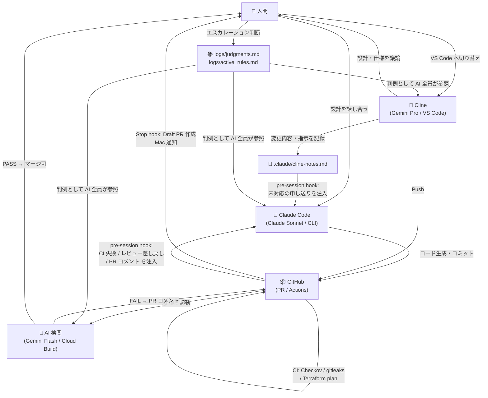

# AI 開発フィードバックループ

プロジェクトの実装とは独立した、このチームの「AI 協調開発フロー」の全体像。

---

## 登場人物

| ロール | 正体 | 役割 |
|---|---|---|
| **Claude Code** | Claude Sonnet (CLI) | 実装・設計議論・コード生成 |
| **Cline** | Gemini Pro (VS Code) | 設計レビュー・仕様議論・Push 前確認 |
| **AI 検閲** | Gemini Flash (Cloud Build) | PR ガバナンスチェック（`.clinerules` 準拠） |
| **人間** | あなた | 最終判断・エスカレーション対応 |

---

## フロー図



---

## フェーズ別の詳細

### Phase 1 — 実装（Claude Code）

```
人間 ←→ Claude Code
         ↓ コミット
         Stop hook 発火
         ↓
         Draft PR 自動作成 + Mac 通知
```

- 人間と Claude Code が設計を議論し、コードに落とす
- セッション終了時に `post-session.sh` が main より ahead なコミットを検知
- Draft PR を自動作成し、Mac 通知で「Cline へのバトン」を伝える

---

### Phase 2 — レビュー（Cline）

```
人間 ←→ Cline (VS Code)
         ↓ 設計変更があれば
         .claude/cline-notes.md に記録
         ↓ Push
         GitHub Actions 起動
```

- Cline と人間が仕様・設計を議論（Claude Code とは違う AI との二重チェック）
- 設計変更・差し戻し・Push エラーが起きたら `.claude/cline-notes.md` に追記
- 問題なければ Push → CI 起動

---

### Phase 3 — 自動 CI チェック（GitHub Actions）

```
Push / PR
  ├─ Checkov (CIS GCP)       → MEDIUM 以上でハードフェイル
  ├─ gitleaks (シークレットスキャン) → 全履歴スキャン
  └─ Terraform plan          → stg/prd/org-policy 各環境
```

- CI 失敗は `pre-session.sh` が次の Claude Code セッション開始時に自動注入

---

### Phase 4 — AI 検閲（Gemini Flash）

```
PR (Ready for Review)
  └─ Cloud Build: pr_reviewer.py
       ├─ .clinerules を憲法として参照
       ├─ active_rules.md の判例を優先
       ├─ PASS → Status Check 通過
       └─ FAIL → PR コメント + Status Check ブロック
                  ↓
                  pre-session.sh が次セッションに注入
```

- Draft PR はレビューするがブロックしない（DX-001 判例）
- Ready for Review から厳格ブロック

---

### Phase 5 — 差し戻し → Claude Code へ帰還

```
次の Claude Code セッション開始
  ↓ UserPromptSubmit hook 発火
  pre-session.sh が以下を確認:
    1. AI 検閲 FAIL コメント
    2. レビュー差し戻し (CHANGES_REQUESTED)
    3. CI チェック失敗
    4. Cline による追加コミット
    5. cline-notes.md の未対応申し送り
  ↓
  全て Claude のコンテキストに自動注入
```

---

## 判断の escalation ルール

```
AI 同士で解決できない「利便性 vs ガバナンス」
  ↓
人間にエスカレーション
  ↓
judgments.md に追記（append-only・IPO 監査証跡）
active_rules.md を更新（upsert・AI 全員が参照）
  ↓
以降の AI は全員この判例を優先
```

---

## ファイル配置

```
project-root/
├── .clinerules              # Cline / AI 検閲の憲法
├── CLAUDE.md                # Claude Code 専用ガイド
├── .checkov.yaml            # Checkov 除外設定（意図的除外はコメント必須）
├── .gitleaks.toml           # gitleaks 除外設定
├── logs/
│   ├── judgments.md         # 人間の判断記録（append-only・監査証跡）
│   └── active_rules.md      # AI が読む判例集（upsert）
└── .claude/
    ├── settings.json        # hooks 設定
    ├── cline-notes.md       # Cline → Claude Code 申し送り
    └── hooks/
        ├── post-session.sh  # Stop hook: Draft PR 作成 + Mac 通知
        └── pre-session.sh   # UserPromptSubmit hook: 差し戻し情報注入
```
