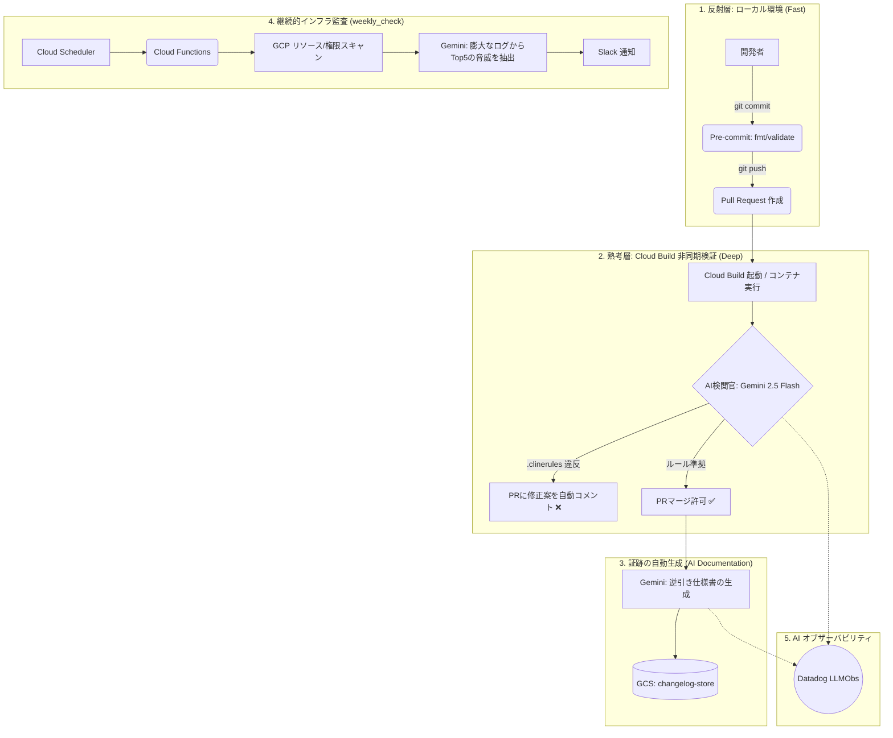

# AI駆動型GCPガバナンス基盤 - AIオーケストレーション仕様書

本基盤における最大の特長は、LLM（Large Language Model: Gemini 2.5 Flash）をDevOpsサイクルとインフラ運用に深く統合した「AIオーケストレーション」です。
これにより、IPO準備企業に求められる「厳格なガバナンス・セキュリティ」と、スタートアップに不可欠な「開発スピード」をトレードオフにすることなく両立しています。

---

## 1. 全体アーキテクチャ概要（Cloud Build移行とDX最適化）

本基盤のAIオーケストレーションは、属人化を防ぎ開発者の負担（だるさ）を解消するため、ローカル環境での同期的な制約を最小限にし、非同期なPR（プルリクエスト）ベースのフィードバックループを採用しています。

### 1.1 アーキテクチャ進化の背景と理由

自律型AI開発特有のリスクと、プレシリーズAというフェーズの制約に合わせて、以下のように設計を進化させました。

1. **実行環境の「クラウド化・標準化」**
   * **最初**: 開発者のローカルPCで動く `pre-commit`（スクリプト）想定。
   * **最終**: Cloud Build + Docker によるCI/CD統合。
   * **理由**: 自律型AIは、自分のローカル環境でスクリプトを回避したり書き換えたりするリスクがあります。クラウド側（CI）でコンテナを動かして検閲することで、AIが回避不能な物理的なガードレールにしました。
2. **監視の目的が「AI警察（ガードレール）」にシフト**
   * **最初**: 人間のエンジニアの「うっかりミス」を防ぐサポーター。
   * **最終**: AIエージェントが勝手に権限を広げないか監視する「検閲官」。
   * **理由**: 精鋭エンジニアが不在（副業）の間に、AIエージェントが「動かすこと」を優先してIAM権限をガバガバにするのを防ぐため、より「セキュリティ・統制」に特化した役割に変更しました。
3. **「証跡の保存先」の現実化（コストと実用性）**
   * **最初**: ログや逆引き仕様書を Datadog に保存（案）。
   * **最終**: PRへの自動コメント ＋ GCS（証跡）＋ Datadog（メトリクス監視）の三層構造。
   * **理由**: 長文ドキュメントを Datadog に貯めるとコストが重すぎるため、役割を分離しました。GCS は監査法人が後で参照できる append-only の証跡保存先。Datadog は `result` / `category` 等のタグ付きカウントメトリクスに絞り、違反傾向の可視化・アラートに使用。`DATADOG_ENABLED=false` で即時停止可能な設計にしています。

### 1.2 全体ワークフロー

大きく分けて以下の3つの領域で機能します。

1. **開発・デプロイ前（シフトレフト）**: Cloud Buildを用いた非同期なAI自律コードレビュー
2. **監査・証跡管理（ドキュメンテーション）**: 逆引き仕様書（Changelog）の自動生成とGCS直送。Datadog にはメトリクスのみ送信（ON/OFF 切り替え可）
3. **継続的監視・運用（セキュリティポスチャ管理）**: AIによる週次インフラ監査とTop5リスク要約

---

## 2. コア機能の詳細と開発体験 (DX)

### 2.1 PR非同期自律コードレビュー (AI Cross-Verification on Cloud Build)
ローカルでの検閲待ちという「開発のリズムを止める」要因を排除し、Cloud Build上のDockerコンテナ（AI検閲官）で非同期に実行します。

*   **処理の流れ**:
    1.  開発者がPRを作成するとCloud Buildが起動し、`ai-verifier` コンテナが `git diff` と `.clinerules` を取得します。
    2.  Gemini 2.5 Flashがレビュアーとなり、「憲法の思想（設計の根本ルール）に違反していないか」を厳格にチェックします。
*   **開発体験 (DX) の最適化**:
    単に「ビルドを落とす」のではなく、AIがPRに対して具体的なアクションを提案します。違反を検知した場合は、以下のようにGitHub PRへ直接コメント（Suggestion）を投稿します。
    > **🤖 AI検閲官からのアドバイス**
    > **[指摘理由]:** OSSとして公開予定ですが、`config.json` にパスワードがハードコーディングされています。
    > **[修正案]:** `os.getenv()` を使用し、Secret Managerから取得するように変更してください。
    開発者は「提案を採用」するだけで修正が完了し、有能なペアプロ相手がいるような体験を実現します。

### 2.2 逆引き仕様書の自動生成 (Automated Changelog)
PRがAIのレビューを通過した場合、AIは同じコード差分から「逆引き仕様書（変更証跡）」をMarkdown形式で自動生成します。

*   **出力内容**:
    「誰が、何のために、どのような変更をしたか」「セキュリティやIPO監査の観点でどう評価できるか」を構造化された文章で出力。
*   **セキュアな保存戦略**:
    生成された仕様書は、Gitリポジトリにはコミットされません。機密情報の漏洩やリポジトリの肥大化を防ぐため、監査チームのみがアクセス可能な専用の GCS バケット (`[PROJECT_ID]-changelog-store`) に直接アップロードされます。

### 2.3 週次インフラ監査ボット (Weekly Security Check)
`infra/modules/weekly_check` で展開される Cloud Functions は、GCP全体のセキュリティポスチャを定期的にスキャンします。

*   **課題**: 従来のスキャンツールは「全てのアラート」を出力するため、ノイズが多く形骸化しやすい。
*   **AIによる解決**: スキャン結果（JSON）をGeminiに渡し、「現在の構成において、本当に今すぐ対応すべき重大なリスク Top 5」を抽出・要約させます。
*   **効果**: 運用チームは、AIが翻訳した「客観的かつ優先順位付けされたアラート」をSlackで受け取るため、アクションに直結します。

---

## 3. 堅牢性とオブザーバビリティ (Fail-safe & LLMObs)

AIをインフラのクリティカルパスに組み込むにあたり、経済性と安全性を担保する設計を導入しています。

### 3.1 経済的正気とモデル選択
高価なモデルの無秩序な利用を防ぐため、検閲・監視にはコストパフォーマンスに優れた **Gemini 2.5 Flash** を採用しています。巨大な `.clinerules` はコンテキストキャッシングを利用してトークン消費を抑え、高い精度と経済性を両立させています。

### 3.2 厳格モードの強制 (`STRICT_AI_VERIFY`) と機密情報のマスク
*   **Fail-closed設計**: `.clinerules` で `@metadata: STRICT_AI_VERIFY=true` が設定されている場合、AI検証の失敗やAPIエラーは即座にPRマージをブロックします。
*   **自動マスク処理**: AIへデータを送信する前に、パスワード、APIキー、プライベートIPなどを正規表現で `[REDACTED]` に置き換え、情報漏洩を防ぎます。

### 3.3 Datadog メトリクス監視（ON/OFF 切り替え可）
AI検閲の結果を Datadog カスタムメトリクス (`gcp.ai_verifier.review`) として送信します。`cloudbuild-pr.yaml` の `DATADOG_ENABLED` 環境変数で即時 ON/OFF 可能です。

**送信タグ一覧:**

| タグ | 例 | 用途 |
|---|---|---|
| `result` | `pass` / `fail` | 合否の時系列集計 |
| `category` | `iam` / `secret` / `network` / `hardcoding` | 違反傾向の分析（FAILのみ） |
| `author` | GitHubユーザー名 | PR作者別の統計 |
| `is_draft` | `true` / `false` | Draft/Ready別の内訳 |
| `repo` | リポジトリ名 | マルチリポジトリ運用時の識別 |

長文ドキュメントの保存には使用しません（コスト観点）。証跡は GCS に保存し、Datadog は可視化・アラート専用とします。
*   **AI_PASS_RATE**: 全PRのうち、一発で検閲を通った割合（開発者のルール理解度の指標）。
*   **AI_TOKEN_USAGE**: PRごとのトークン消費量とコスト。
*   **JUDGMENT_REQUEST_COUNT**: AIが人間に判断を仰いだ（エスカレーション）回数。

---

## 4. 総括

この「AIオーケストレーション」により、「個人の狂気（ローカルスクリプト）」は「組織の資産（CI統合プラットフォーム）」へと変換されます。
**「設計思想（憲法）のコード化」と「継続的な監査証明」を、開発者のリズムを止めずに完全自動化する**ことで、エンジニアの仕事は「コードを書くこと」から「AIというエージェント群を統治すること」へシフトします。スタートアップのスピードを維持しつつ、IPO審査に耐えうる強固なガバナンス基盤を提供します。
