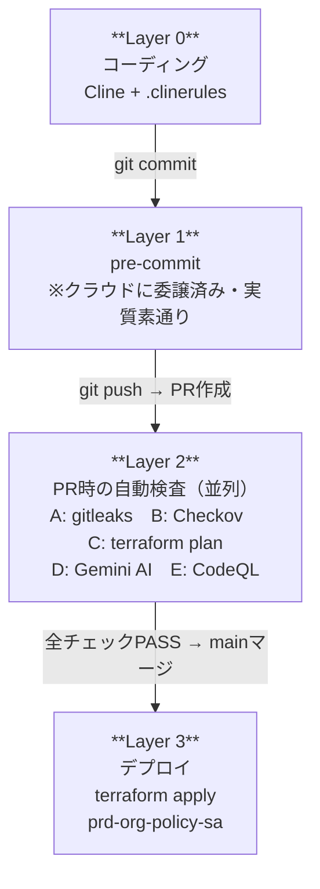
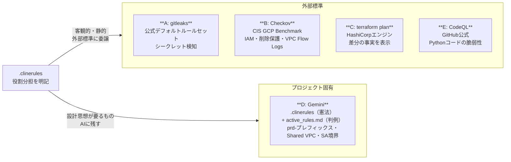
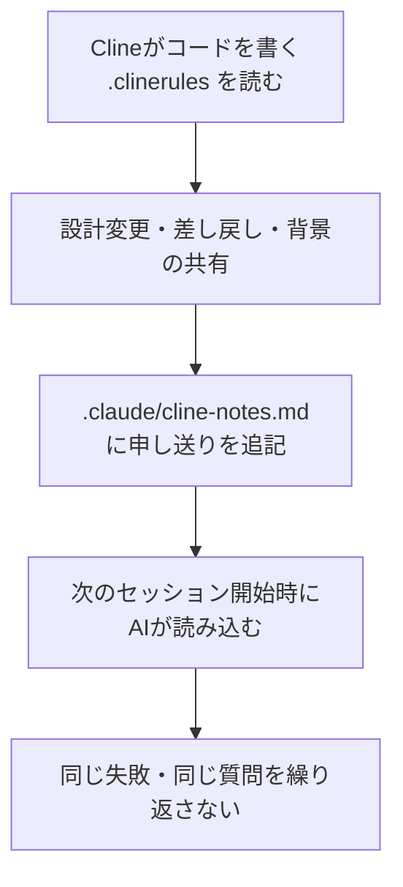
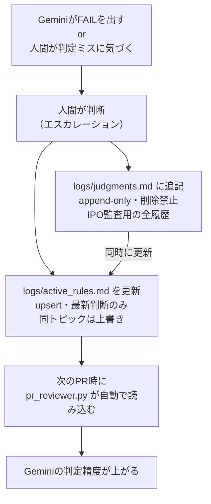
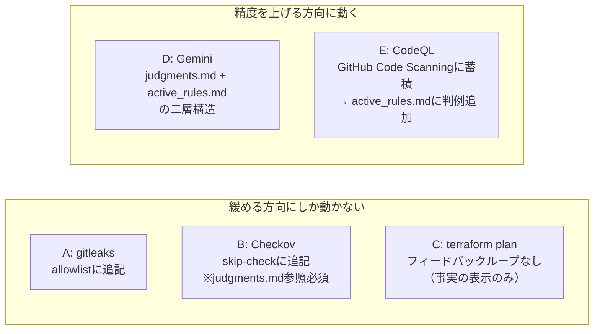
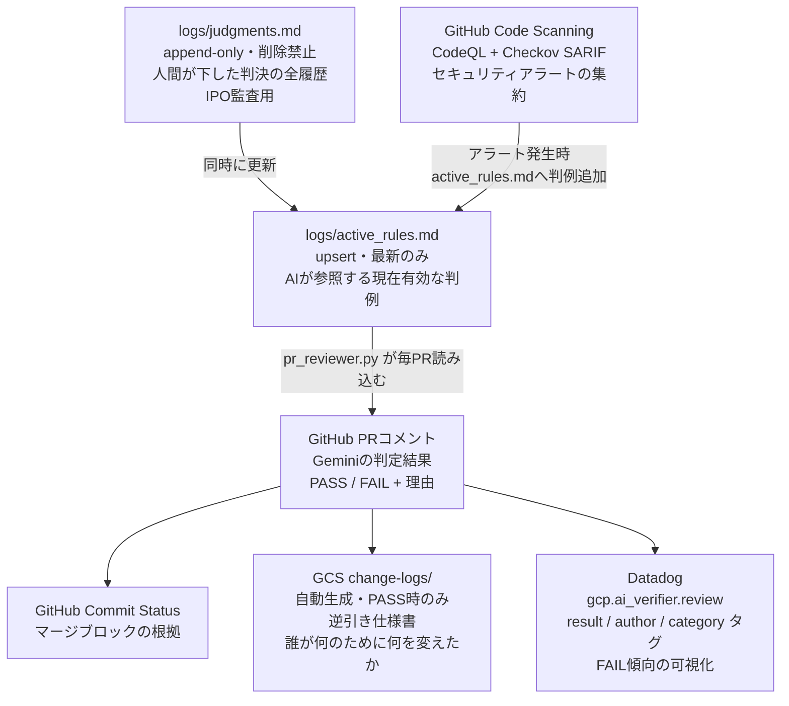
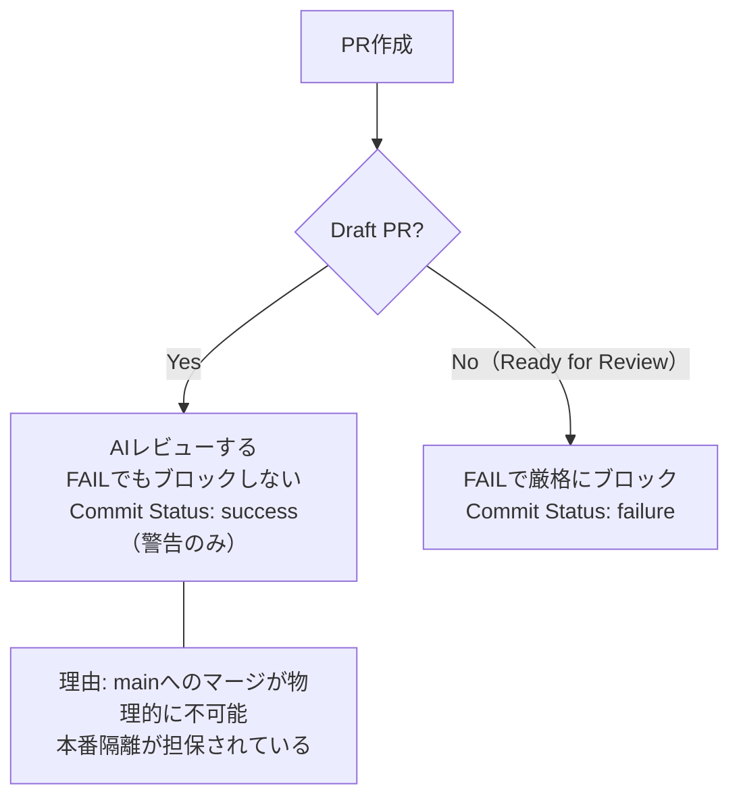
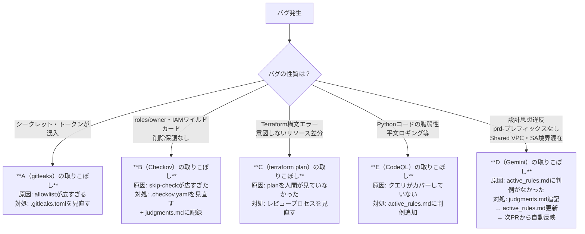
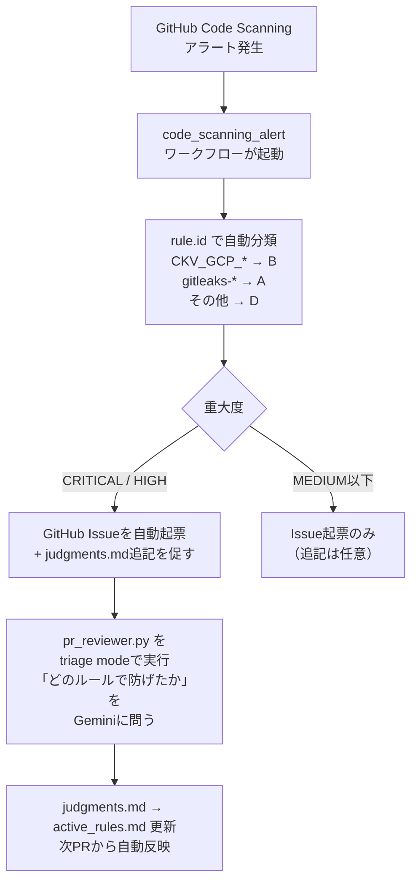

# 品質管理とフィードバックループ

コーディングからデプロイまでの品質がどう保証され、どう改善されていくかを整理したドキュメント。

---

## 全体構造

---

## Layer 2 の詳細：何を根拠に判定しているか

A〜Dは外部標準に乗り、Dはプロジェクト固有の判断をする。この役割分担が設計の核心。

| レイヤー | 根拠 | 判定主体 |
|---|---|---|
| A（gitleaks） | gitleaks公式デフォルトルールセット | OSSコミュニティ |
| B（Checkov） | CIS Google Cloud Platform Foundation Benchmark | CIS（国際標準団体） |
| C（terraform plan） | Terraform エンジンの差分計算 | HashiCorp |
| D（Gemini） | `.clinerules`（憲法）+ `logs/active_rules.md`（判例） | プロジェクト設計 |
| E（CodeQL） | GitHub公式セキュリティクエリ | GitHub Security Lab |

---

## フィードバックループ

### Layer 0（Cline）

Clineはセッションをまたいで記憶を持たないため、ファイルが記憶の代わりになる。

> **特性：** 人間が `cline-notes.md` を書かないとループが回らない。人手依存。

---

### Layer 2 D（Gemini）

PRのたびに自動でファイルを読むため、ファイルを更新するだけでループが回る。

> **特性：** 判例が積み重なるほど精度が上がる。人間の介入は「判断を書く」だけでよい。

---

### フィードバックの方向性の非対称性

> **リスク：** A・Bはskip/allowlistが積み重なるほど「意図的な例外か穴か」の管理コストが増える。Bはコメントと `judgments.md` 参照を義務付けることでこれを抑制している。

---

## 証跡の全体像

---

## Draft PRの扱い（判例 DX-001）

> `[skip ai]` のようなバイパスを作らない理由：IPO監査で「誰がどの権限でバイパスしたか」を証明できなくなるため、職務分掌・証跡確保の原則に反する。

---

## バグが出たときの切り分け

---

## 今後の課題：バグ切り分けの自動化

CodeQL アラートをフィードバックループに自動で取り込む構想。

> `pr_reviewer.py` はすでに diff取得・Gemini呼び出し・GitHubコメント投稿の実装を持っているため、プロンプトを差し替えるだけで triage mode として転用できる。
