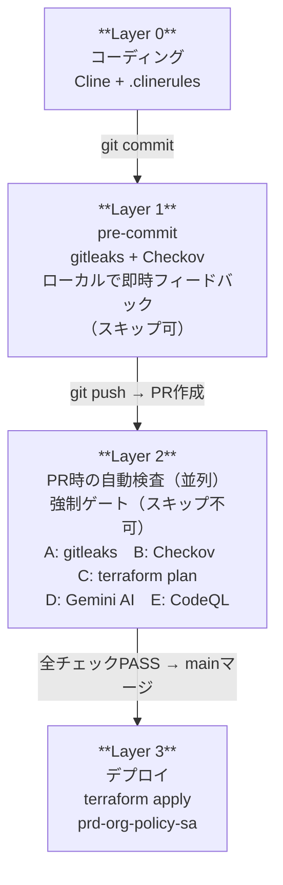
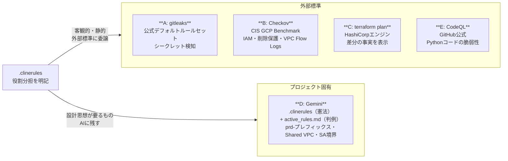
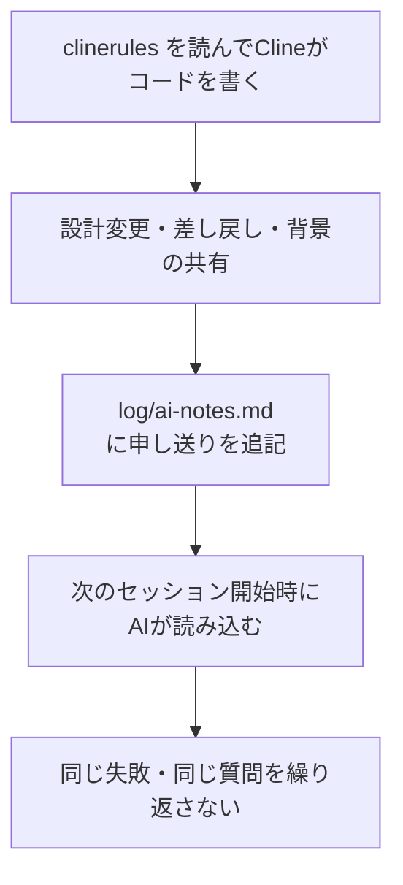
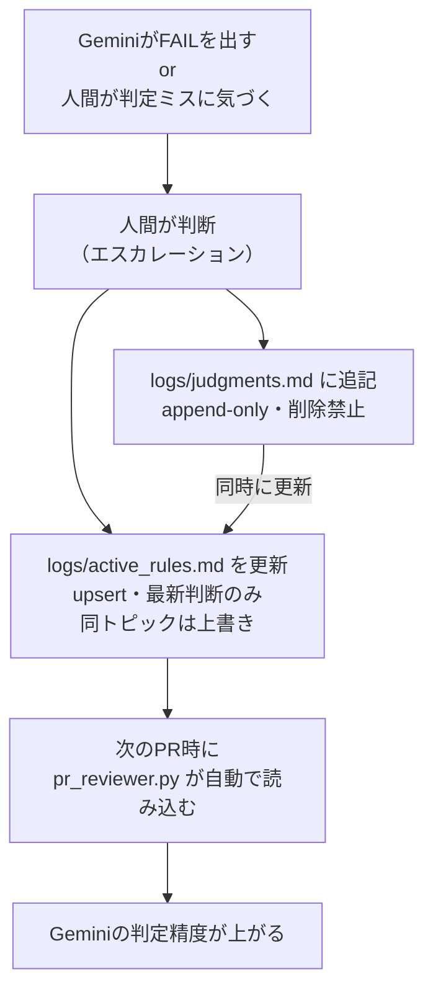
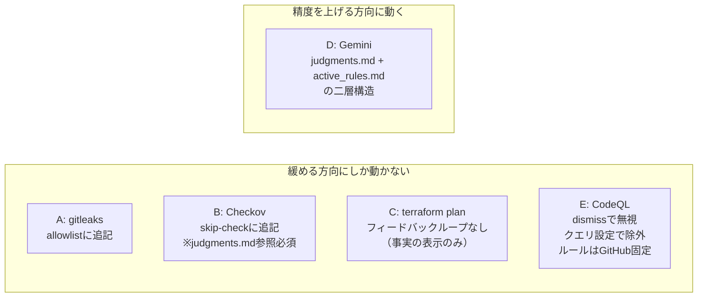
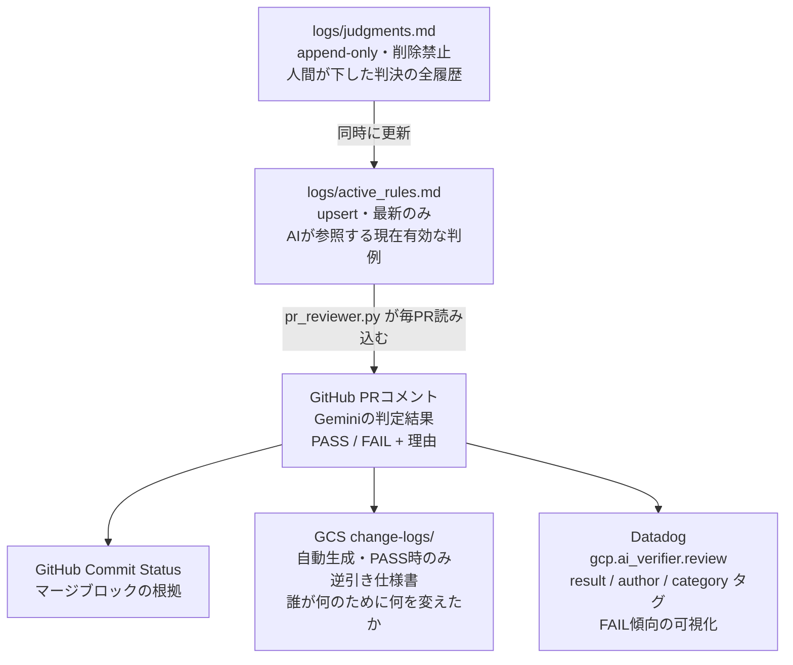
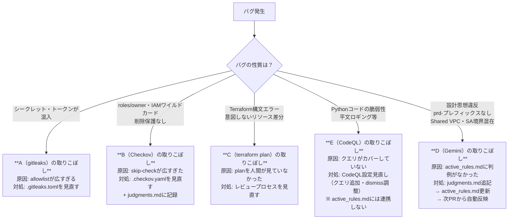

# 品質管理とフィードバックループ (Quality Assurance & Feedback Loop)

本ドキュメントは、本GCP基盤におけるAI生成コードの品質管理アーキテクチャ、および継続的な品質改善のためのフィードバックループについて定義する。

---

## 1. 全体構造
本プロジェクトでは、コードの自動生成から本番デプロイに至るプロセスを複数のレイヤーに分割し、段階的に品質を保証する。AIによる主観的検証と、ツールによる客観的検証を適材適所で組み合わせることで、検証コスト（時間・金銭）の最適化を図っている。



---

## 2. Layer 2 の詳細：判定基準と責任分界点

Layer 2における各検証プロセスは、その判定基準となる「根拠」によって明確に役割が分担されている。外部標準に基づく客観的なチェックと、プロジェクト固有の設計思想に基づくAI検証を分離することが本設計の核心である。



| レイヤー | 根拠 | 判定主体 |
|---|---|---|
| A（gitleaks） | gitleaks公式デフォルトルールセット | OSSコミュニティ |
| B（Checkov） | CIS Google Cloud Platform Foundation Benchmark | CIS（国際標準団体） |
| C（terraform plan） | Terraform エンジンの差分計算 | HashiCorp |
| D（Gemini） | `.clinerules`（憲法）+ `logs/active_rules.md`（判例） | プロジェクト設計 |
| E（CodeQL） | GitHub公式セキュリティクエリ | GitHub Security Lab |

---

## フィードバックループ

### Layer 0（開発 AI エージェント）

開発を担当するAIエージェント（Cline）はセッション間でコンテキストを保持しないため、ルールやプロジェクト固有の微調整をファイルシステム上に記憶として永続化する。



> **特性:** 本レイヤーのフィードバックループは、人間による明示的な記録（`log/ai-notes.md`の更新）に依存する。

---

### Layer 2 D（検証 AI エージェント）

Pull Request作成時に自動実行されるAIレビューのフィードバックループ。継続的な運用に耐えうるよう、人間向けとAI向けの記録ファイルを分離している。
- `logs/judgments.md`: 人間が下した判断の全履歴（Append-only）。IPO監査や経緯確認用。
- `logs/active_rules.md`: AIが参照する現在有効なルールのスナップショット。同トピックは上書きされ、コンテキスト長を節約する。



> **特性:** 判例が蓄積されるほど自律的に検証精度が向上する。人間の介入は「最終判断の明文化」のみで完結する。

---

### 検証ツールの性質とフィードバック方向の非対称性
外部標準に依存するツール（A, B, C, E）の検知漏れはツールのカバレッジ限界に起因するが、プロジェクト固有のAI検証（D）の検知漏れは「判例の不足」または「プロンプトの曖昧さ」に起因する。
さらに、フィードバックループが精度に与える「作用の方向性」もツールによって異なる。

```text
A の取りこぼし → .gitleaks.toml の見直し（allowlistの縮小）
B の取りこぼし → .checkov.yaml の見直し（skip-checkの削減）+ judgments.md への記録
C の取りこぼし → terraform plan の人間によるレビュープロセス改善
D の取りこぼし → judgments.md へ判例追加 → active_rules.md 更新 → 次回PRから自動適用
E の取りこぼし → CodeQL設定見直し（クエリやdismissの調整のみ）
```



フィードバックループで「判断ルール」に反映できるかどうかが、作用方向の分かれ目。CodeQLのルールはGitHub Security Lab固定であり、プロジェクト側でできるのはalert dismissやクエリ除外（制約を緩める方向）のみ。Geminiだけが判例の蓄積によって精度を上げる方向に動く。



## 3. バグ発生時のトラブルシューティングと切り分け

本番環境または結合テストで問題が発覚した場合、以下のフローに従って原因となった検証レイヤーを特定し、フィードバックループを回す。



---

## 4. 運用上の課題と今後の展望

### 4.1 フィードバックループの人手依存
現状、各種ログファイル（`judgments.md`, `active_rules.md`, `ai-notes.md`）の更新は人間の介入を前提としている。今後はIssueやPRの議論からAIが自動で判例ドラフトを作成する仕組みが望まれる。

### 4.2 terraform plan の自動ゲート化
現在 `terraform plan` の結果はPRにコメントされるのみであり、破壊的変更を機械的にブロックする仕組みが存在しない。OPA（Open Policy Agent）や Sentinel の導入によるポリシーのコード化（Policy as Code）が今後の課題である。

### 4.3 Datadog アラートの欠如
AI検証の合否メトリクスはDatadogに送信されているものの、連続FAIL等の異常検知アラートが設定されていない。監視基盤の拡充が必要である。

### 4.4 GitHub Code Scanning との関係（設計上の決定）

GitHub Code Scanning（CodeQL + Checkov SARIF）はセキュリティアラートの履歴を蓄積するが、**`active_rules.md` への自動連携は行わない**という設計判断を下している。

理由は、CodeQLやCheckovが検出するのは「コードの客観的パターン」（未使用import、平文ロギング、IAMワイルドカード等）であり、これらはすでに静的解析ツールがカバーしている。「プロジェクトの設計思想を知らないと判定できない」という性質を持たないため、Gemini（D）に判例として学習させる必要がない。

```text
GitHub Code Scanning
  └─ CodeQL / Checkov SARIF アラート蓄積
       └─ alert dismiss / クエリ除外 でのみ対応（緩める方向）
            ※ active_rules.md には連携しない
```

> **判断基準:** `active_rules.md` に追加すべきなのは「同じ状況でGeminiが同じ判定ミスを繰り返す」ケースのみ。CodeQL findings はGitHub Code Scanningで管理し、ツールの設定（クエリ・dismiss）で対応する。

### 4.5 自動化の境界と人間の役割（設計哲学）
障害の根本原因や「例外か違反か」の判断は、プロジェクトの設計思想に深く依存するためAIによる完全自動化は困難である。したがって、本システムの自動化のゴールは**「人間の判断を要求するところまで情報を整理して運ぶこと」**に設定している。
ウォーターフォール開発における「バグの流出フェーズ分析」と同様に、AI駆動開発においても「どのツール/プロンプトがそのバグを検出すべきだったか」を特定し、適切なレイヤーの仕組みを改善することが、長期的な品質安定化の鍵となる。

---

## 5. レイヤーごとの責務と仕組みの強制

開発体験とセキュリティ・ガバナンス要件を両立するため、以下の役割分担を定義する。

* **Layer 1（pre-commit）:** gitleaks + Checkov 
  * **目的:** 開発者への即時フィードバック
  * **制約:** スキップ可（ローカルの柔軟性確保）
* **Layer 2（PR）:** gitleaks + Checkov + AI Review 
  * **目的:** 本番環境への危険なコードの混入防止
  * **制約:** 強制ゲート（GitHub Actions Required Status Checksによるスキップ不可）

### Layer 1 の確実な運用（仕組み化）
Layer 1 は開発者のローカル環境に依存するため、「インストール忘れ」によるすり抜けリスクが存在する。これを防ぐため、本プロジェクトでは**初期セットアップスクリプト（`scripts/bootstrap.sh`等）に `pre-commit` のインストールを組み込み、開発参加時に自動的かつ強制的に仕組みが適用される**アーキテクチャを採用している。
